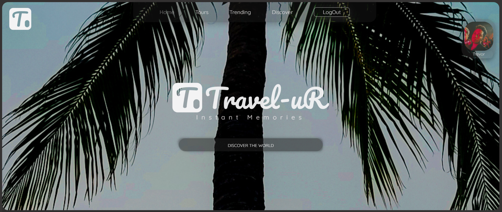
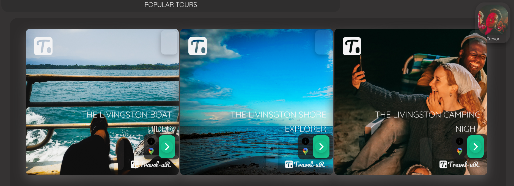

# travel-R_demo_app

<p align="center">
  
  [](https://docker.com)
  [](https://docker.com)
  [](https://docker.com)
    [](https://docker.com)
      [](https://docker.com)
    [](https://docker.com)
    [](https://docker.com)
    [](https://docker.com)
    [](https://docker.com)
    
</p>

This Application demostrates a Classics MERN architecture for a fulstack application over React.js / Typescript, Node.js, express and MongoDB of a travel agency, also includes a mobile end

## Technologies that were Used

<p align='center'>
  <a href='https://skillicons.dev'>
    
  </a>
</p>

> Branding Logo
>  > 

> Some from the React.js / SASS Front_end UI (Desktop)
> 

> Code Samples
> Here we can see a simple reusable component that renders data inputed form an API call though an object and renders a travel top tour sections

```typescript
const ContextType = "div";
/////COMPONENET/////COMPONENET/////COMPONENET/////COMPONENET/////
/////COMPONENET/////COMPONENET/////COMPONENET/////COMPONENET/////
export default function TopTours({
  children,
  _tours,
  _className,
  _style,
  _onClick,
  ...rest
}: _defaultProps) {
  ///////FUNCTIONS//////////FUNCTIONS///////////FUNCTIONS///////////

  ////////RETURN/////RETURN/////RETURN/////RETURN/////RETURN/////
  return (
    <ContextType
      {...rest}
      className="row__middle"
      onClick={_onClick}
      style={_style}
    >
      {/* <TourSection> */}
      {_tours?.map((tour) => (
        <OneSidedProductCard
          _wrapperClassName="grider"
          _title={tour?.name}
          _Location="Livingston Izabal"
          _dscTag="DIFFICULTY"
          _dscTagText={tour?.difficulty}
          _rating="RATING"
          _ratingText={tour?.ratingsAverage.toString()}
          _only="Only"
          _price={tour?.price.toString()}
          _imageCover={_defaultTourDir + tour?.imageCover} //{tour?.imageCover}
          _imgPrefixDir={_defaultTourDir}
        />
      ))}
      {/* </TourSection> */}
      {children}
    </ContextType>
  );
}

/////TYPE/////TYPE/////TYPE/////TYPE/////TYPE/////TYPE///////
/////TYPE/////TYPE/////TYPE/////TYPE/////TYPE/////TYPE///////
type _defaultProps = {
  children?: React.ReactNode;
  _tours?: Tours;
  _className?: string;
  _style?: React.CSSProperties;
  _onClick?: () => void;
};
```

> The rendered UI
> 

Here a demosntration of a `useLogOut.tsx` custom hook for loggin user out, notifies user using UI uses other custom hooks, ensures coocki data or user related data previously writen to local storage gets erased and moves user to home page after showing a notification via modal.

```typescript
//> LOGOUT CUSTOM HOOK
export const useLogOut = async (
  //> VRABILES INPUT TYPES DECLARATIONS
  _userSetter: React.Dispatch<React.SetStateAction<User | null>>,
  _modalCloser: () => void,
  _navigator: void | Promise<void>,
  _endPoint: string = "users/logout",
  _method: string = "GET",
  _loggable: boolean = false
) => {
  try {
    //> TRY TO FETCH DATA FROM BACKEND USING CUSTOM FETCHER
    const _response: any = await FetchData({
      _endPoint: _endPoint,
      _method: "GET",
    });

    const _resData = await _response.json(); //> IF DATA GO AHEAD SIR!
    if (_loggable) console.log("from log out", _resData); //> LOGGER
    //> ON SUCCESS PROCEED TO THE USER STEP PIPELINE
    if (_resData.status === "success") {
      _userSetter(_userDefault); //< MODIFY LOCAL STORAGE
      _modalCloser; //> CLOSES THE MODAL WITH ANIMATION [ AND REF ]
      //> ENSURES NO DATA IN LOCAL STORAGE FROM PREVIOUS USER PERSISTS
      useLocalUser({ _action: "remove", _storageKey: "user" });
      showAlert("success", "Succesflly Logged Out!"); //> UI SUCCESS ALERT

      logActions({
        //> COORDINATES UI ACCTIONS SUCH AS NAVIGATE TO HOMEPAGE
        _action: "logout",
        _direct: () => _navigator,
      });
    }
  } catch (err) {
    showAlert("error", err); //> ON ERROR NOTIFIES USER THROUGH UI
    if (_loggable) console.log(err); //> LOGGER TO CONSOLE IF TRUE
  }
};
```

For this project and as a personal preference I utilize `SASS` for styling much of the times over `tailwind` which is a great option too, and here some `SCSS` code that demostrates the creation of custom `@mixins` that accepts inputs making a generic styling function.

```scss
@mixin section_base(
  //> set double on wrapper
  $height: 50.7vh,
  $width: 100%,
  $media-query: "tab-land",
  $borderRadius: vars.$section-border-radius,
  $bgColor: themeColors.$colors-sections-base
) {
  background-color: $bgColor;
  height: $height;
  width: $width;
  border-radius: $borderRadius;

  @include mixins.respond($media-query) {
    height: calc((#{$height} * 2));
  }
}

@mixin section_wrapper(
  //> on media Query sets double of bases vh
  $height: 95%,
  $width: 98.5%,
  $margin: 1.6rem,
  $display: flex,
  $flexDirection: row,
  $padding: 0.06rem,
  $media-query: "tab-land",
  $shadox: themeColors.$colors-section-wrapper-shadow,
  $borderRadius: vars.$section-border-radius,
  $bgColor: themeColors.$colors-sections-base
) {
  background-color: themeColors.$colors-section-wrapper;
  border-radius: $borderRadius;
  height: $height;
  margin: $margin;
  width: $width;
  display: $display;
  flex-direction: $flexDirection;
  padding: $padding;
  box-shadow: 0 0 2.1rem 0.6rem themeColors.$colors-section-wrapper-shadow;

  @include mixins.respond($media-query) {
    flex-direction: column;
  }
}
```

Then simply invoke the functions inside your target `.scss` class in form of `@include [name_of_class].section_wrapper([inputs_if_needed]);` simple as that, you can re-use entire layOut styles, element styles, and even animations, though you may like to use something like the amazing react library `motion.framer`, for simple animation / UI element transitions `scss` still makes a great job.

> All assets were designed and created in
> 

<p align='center'>
  

</p>
